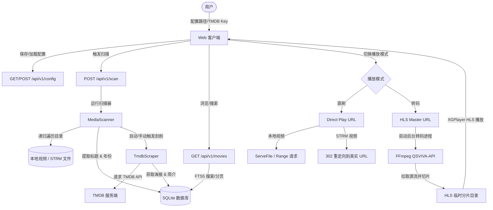

# RustMediaCenter: QSV 转码与 Web (XGPlayer) 播放设计文档

> **版本**: v1.1
> **日期**: 2026-06-09
> **主题**: QSV 实时硬解转码、XGPlayer 播放器集成及完整链路设计

---

## 1. 整体设计目标

本设计旨在完善 RustMediaCenter 项目，打通 **配置 → 扫描 → 入库 → 刮削 → 浏览 → 播放** 完整链路，并支持：
1. **客户端自行硬解 (Direct Play)**：本地视频直刷（支持 HTTP Range）；STRM 视频通过 `302 Found` 重定向直接播放。
2. **服务端 QSV 硬件转码 (Transcode Play)**：在 Linux 环境下，利用 Intel UHD 770 核显（使用 Intel QSV 或 VA-API），实时对本地或 STRM 源视频进行 HLS 编码切片输出。
3. **Web 端 XGPlayer 播放**：在网页端集成字节跳动开源的 XGPlayer 播放器，原生支持 Direct Play 播放，并通过 HLS 插件支持 HLS 转码流播放。支持在播放界面无缝切换“直刷”与“转码”模式。
4. **外部播放器兼容性**：提供兼容 MPV/VLC 的直接播放与转码流 URL，支持客户端/外部播放器硬解。

---

## 2. 核心架构与数据流



---

## 3. 数据库与配置项升级

### 3.1 `Movie` 模型与数据库表扩展

```rust
// crates/rmc-core/src/models.rs
pub struct Movie {
    pub id: i64,
    pub title: String,
    pub year: Option<u16>,
    pub file_path: std::path::PathBuf,
    pub poster_url: Option<String>,
    pub overview: Option<String>,
    pub tmdb_id: Option<i64>,
    pub runtime_minutes: Option<u16>,
    pub added_at: i64,
    pub file_size: Option<u64>,
}
```

**数据库升级方案 (`db.rs`)**：
* 数据库从当前的 `sqlite::memory:` 改为真实文件，路径从配置中读取（例如 `data/rmc.db`）。
* 初始化 SQL 表结构：
  ```sql
  CREATE TABLE IF NOT EXISTS movies (
      id INTEGER PRIMARY KEY AUTOINCREMENT,
      title TEXT NOT NULL,
      year INTEGER,
      file_path TEXT NOT NULL UNIQUE,
      poster_url TEXT,
      overview TEXT,
      tmdb_id INTEGER,
      runtime_minutes INTEGER,
      added_at INTEGER NOT NULL,
      file_size INTEGER
  );
  CREATE VIRTUAL TABLE IF NOT EXISTS movies_fts USING fts5(title, overview, content='movies', content_rowid='id');
  ```

### 3.2 配置项扩展 (`config.rs`)

支持动态修改和保存：
```rust
#[derive(Debug, Clone, Serialize, Deserialize)]
pub struct ServerConfig {
    pub port: u16,
    pub media_dirs: Vec<String>,
    pub db_path: String,
    pub tmdb_api_key: String,
}
```

---

## 4. QSV 硬件转码引擎设计 (`transcode.rs`)

转码核心在 Linux 环境下，针对 **Intel UHD 770 核显**（基于 Alder Lake / Raptor Lake 架构）进行硬件加速优化。

### 4.1 FFmpeg 转码命令

在 Linux 系统中，使用 `libva` (VA-API) 或 `oneVPL/MSDK` (QSV) 驱动。命令示例如下：

* **VA-API 硬件转码命令 (推荐在 Linux 通用核显下使用)**：
  ```bash
  ffmpeg -hwaccel vaapi -hwaccel_device /dev/dri/renderD128 -hwaccel_output_format vaapi \
    -i <INPUT_PATH> \
    -c:v h264_vaapi -b:v 4M -maxrate 5M -bufsize 8M \
    -c:a aac -b:a 128k \
    -f hls -hls_time 6 -hls_list_size 0 \
    -hls_segment_filename <TEMP_DIR>/seq-%d.ts \
    <TEMP_DIR>/master.m3u8
  ```
* **QSV 硬件转码命令**：
  ```bash
  ffmpeg -hwaccel qsv -c:v h264_qsv \
    -i <INPUT_PATH> \
    -c:v h264_qsv -b:v 4M -preset fast \
    -c:a aac -b:a 128k \
    -f hls -hls_time 6 -hls_list_size 0 \
    -hls_segment_filename <TEMP_DIR>/seq-%d.ts \
    <TEMP_DIR>/master.m3u8
  ```

### 4.2 转码生命周期管理

1. **按需启动**：客户端访问 `/api/v1/movies/:id/hls/master.m3u8` 时：
   * 检查是否已存在当前电影的转码任务。
   * 若无，在临时路径（如 `/tmp/rmc/transcode/<movie_id>`）创建目录，并使用 `tokio::process::Command` 异步启动 FFmpeg 硬件转码进程，保存进程句柄。
2. **心跳与清理**：
   * 客户端每次请求 `.m3u8` 或 `.ts` 文件时，更新该电影的“最后活跃时间戳”。
   * 服务端启动后台定时器，每 30 秒检查一次。若某部电影已超过 60 秒无客户端访问，主动杀死 FFmpeg 进程，并清空对应的临时文件夹。

---

## 5. Web 端 XGPlayer 集成与页面开发

### 5.1 页面路由设计 (`web-client/`)

Web 客户端采用轻量级前端（Vanilla JS），主要包含以下四个主视图：
1. **浏览视图 (`/`)**：海报墙网格，显示已刮削的海报、年份。支持输入框实时搜索（调用 FTS5 搜索接口）。
2. **电影详情视图 (`/movie/:id`)**：显示大图、标题、年份、大小、详细简介，以及“直刷（客户端硬解）”和“转码（服务端硬解）”两个播放按钮。
3. **播放视图 (`/play/:id`)**：集成 XGPlayer，支持无缝解码。
4. **配置视图 (`/settings`)**：设置媒体目录（支持添加多个）、SQLite 数据库路径、TMDB API Key。提供“立即扫描”和“保存配置”按钮。

### 5.2 XGPlayer 播放器集成

```html
<!-- index.html 引入 XGPlayer 核心及其 HLS 插件 -->
<script src="https://cdn.jsdelivr.net/npm/xgplayer@3.0.1/dist/index.min.js"></script>
<script src="https://cdn.jsdelivr.net/npm/xgplayer-hls@3.0.1/dist/index.min.js"></script>
```

```javascript
// main.js 初始化播放器
let player;
function initPlayer(url, isHls) {
    if (player) {
        player.destroy();
    }
    
    let config = {
        id: 'video-player',
        url: url,
        width: '100%',
        height: '100%',
        autoplay: true,
        playsinline: true
    };
    
    if (isHls) {
        config.plugins = [window.XgplayerHls];
    }
    
    player = new window.Player(config);
}
```

---

## 6. 测试与集成验证规格

### 6.1 单元测试与集成测试
* **配置测试**：测试 `config.toml` 的读写与环境变量覆盖。
* **扫描与入库测试**：提供 Mock 目录，测试 `MediaScanner` 正确识别 `.mp4`/`.strm`，防止重复入库，解析标题和年份。
* **FTS5 搜索测试**：测试 `db.rs` 包含 `poster_url` 等字段后的查询，且搜索包含模糊拼音/关键字。
* **转码测试**：测试启动转码任务能够拉起后台 FFmpeg，生成转码临时文件，并在心跳超时后自动回收。

### 6.2 E2E 验证链路
1. 打开配置页面，保存配置项。
2. 点击“立即扫描”，系统开始扫描。
3. 刷新首页，海报墙呈现新入库的视频。
4. 点击电影，展现 TMDB 刮削出的简介与海报大图。
5. 点击“转码播放”，XGPlayer 渲染 HLS 视频流。
6. 点击“直刷播放”，若是本地视频正常读取，若是 STRM 正常进行重定向播放。
